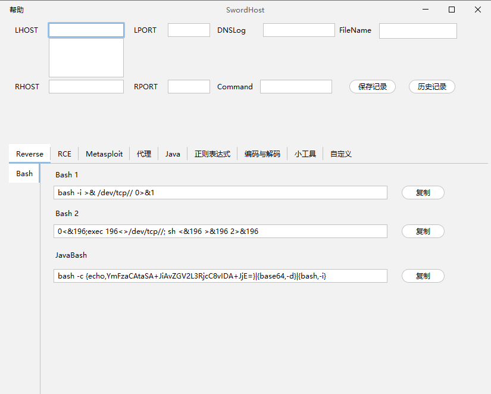
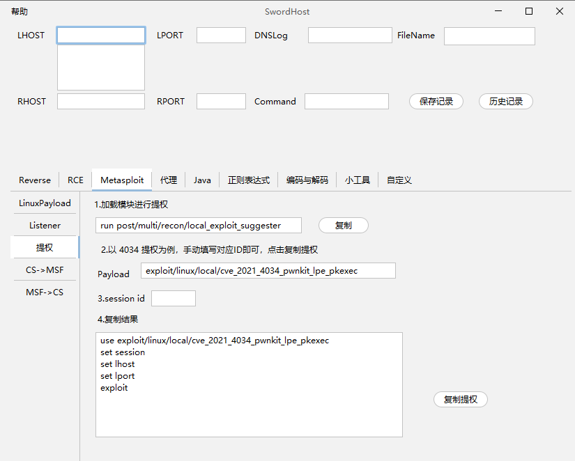
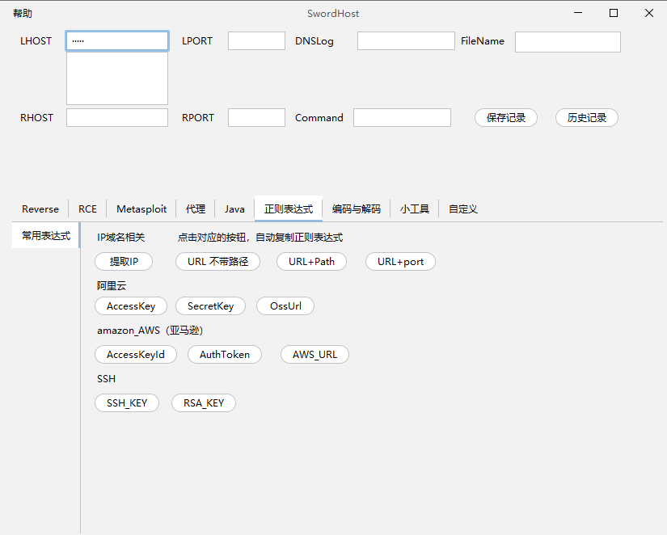
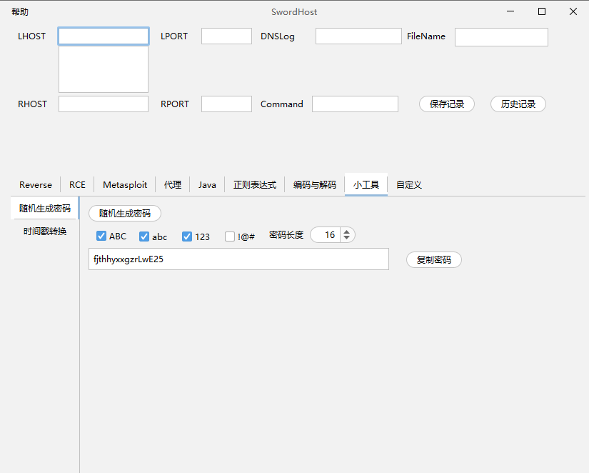

# SwordHost

## 0x01 说明

渗透测试辅助工具箱

运行条件：jdk8+  双击即可运行

反弹shell，命令生成器，自动编码，输入对应IP端口即可，实现一劳永逸，集成一些小工具，辅助渗透，提高效率

### 输入框说明

Lhost：攻击机IP

Lport：攻击机端口

DNSLog：用于Java探测反序列化漏洞使用

Rhost：受害机IP

Rport：受害机端口

Command：命令执行时候使用

FileName：生成木马的名字

## 0x02 使用
在对话框输入自己的IP端口号，点击对应菜单，即可生成命令，进行复制，正则表达式，点击按钮会复制到剪贴板。

保存记录： Lhost，Lport，DNSlog，Filename，Rhost，Rport，Command 里面的内容。

删除记录：删除指定id

主页面

 

MSF页面

 

正则表达式页面

 

小工具页面

 

## 0x03 更新

### v1.0.0

基本功能

## 0x04 参考项目或参考链接

https://github.com/0dayCTF/reverse-shell-generator

https://base64.us/

## 0x05 免责声明

本工具仅能在取得足够合法授权的企业安全建设中使用，在使用本工具过程中，您应确保自己所有行为符合当地的法律法规。
    
如您在使用本工具的过程中存在任何非法行为，您将自行承担所有后果，本工具所有开发者和所有贡献者不承担任何法律及连带责任。

除非您已充分阅读、完全理解并接受本协议所有条款，否则，请您不要安装并使用本工具。

您的使用行为或者您以其他任何明示或者默示方式表示接受本协议的，即视为您已阅读并同意本协议的约束。

该工具仅用于学习交流，出现一切后果与本人无关。